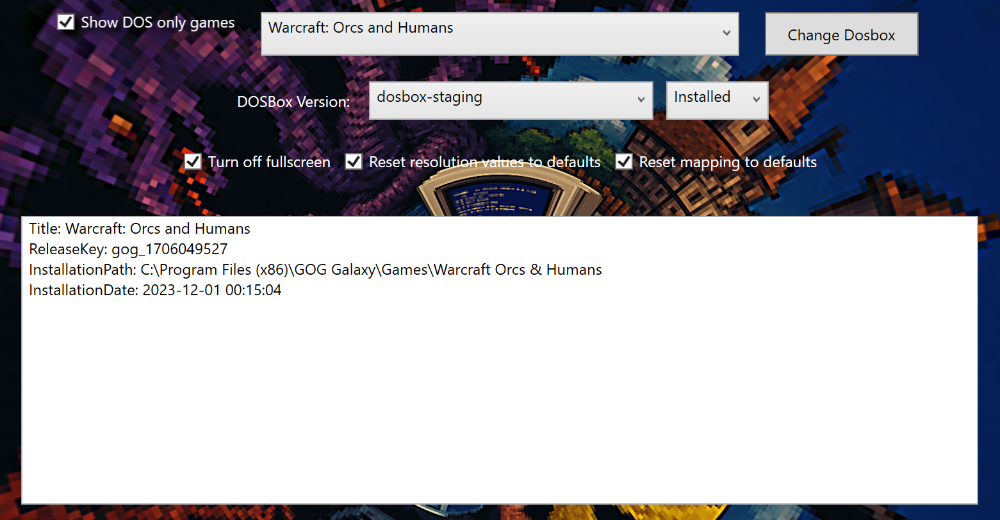

# Dosbox Staging Replacer GUI Wrapper




A lightweight graphical user interface built in WPF for interacting with [`DosboxStagingReplacerForGOGGalaxy`](https://github.com/Shin-Aska/DosboxStagingReplacerForGOGGalaxy), a command-line tool that allows management of DOSBox installations tied to GOG Galaxy games.

---

## 🧩 Features

- Minimalist GUI for browsing and selecting GOG Galaxy games
- Filter for DOS-only games
- Execute `DosboxStagingReplacer.exe` via PowerShell with selected parameters
- Background artwork inspired by classic DOS gaming

---

## 🔧 Requirements

- Windows 10/11
- .NET Framework 4.7.2 or higher
- PowerShell 5.1 or higher
- Ideally have a supported custom Dosbox build installled
---

## 🚀 Usage

### Step by step usage
1. **Get a copy of this script**
------
### The manual way

1. **Clone this repository**  

   ```powershell
   git clone https://github.com/Shin-Aska/DosboxStagingReplacerForGOGGalaxy-UI.git
   ```

1. **Download `DosboxStagingReplacer.exe`**
    Place the executable next to the GUI app, or adjust the script path if needed.
2. **Run the GUI (PS1 script) [main.ps1]**
    The app will:
   - List available games via the replacer tool
   - Let you select a game and apply changes (e.g., replace DOSBox path)

### The easier way
1. **Download the latest release**  
   Get the bundled.zip from the latest version of the [releases page](https://github.com/Shin-Aska/DosboxStagingReplacerForGOGGalaxy-UI/releases/latest)
------
2. **Select a game in the selection that you wish to replace your DOS runner game with**
3. **Customize the options (such as Dosbox version) to what you want**
4. **Click the Change DOSBox button**

------

## 📁 Repository Contents

| File                     | Description                                       |
| ------------------------ | ------------------------------------------------- |
| `Interface.xaml`         | The WPF UI layout (with background image support) |
| `main.ps1`               | PowerShell script wrapper for CLI integration     |
| `dosbox-replacer.png`    | Retro-themed background image                     |

There are other files in the repository, but they are not relevant to the GUI. Such as anything under `/docs`, 
the `.gitignore` file, and this `README.md` file itself.

## 📦 Related Project

This GUI is a front-end for:
 🔗 [`DosboxStagingReplacerForGOGGalaxy`](https://github.com/Shin-Aska/DosboxStagingReplacerForGOGGalaxy)

------

## Antivirus detection

This script may contain code that will get flagged by your antivirus. If this happens, mark it as a false positive.
I strongly recommend you to check the code and understand what it does before running it. I have added comments to the code to help you understand it.

Instead of embedding the UI, I purposefully kept it separate to allow for easy updates, modifications and inspection of the code. This way, you can easily see what the script does and how it works.

## 📝 License

This project follows the same licensing model (MIT/public domain) as the upstream tool.
 Refer to [DosboxStagingReplacerForGOGGalaxy LICENSE](https://github.com/Shin-Aska/DosboxStagingReplacerForGOGGalaxy/blob/main/LICENSE) for details.
